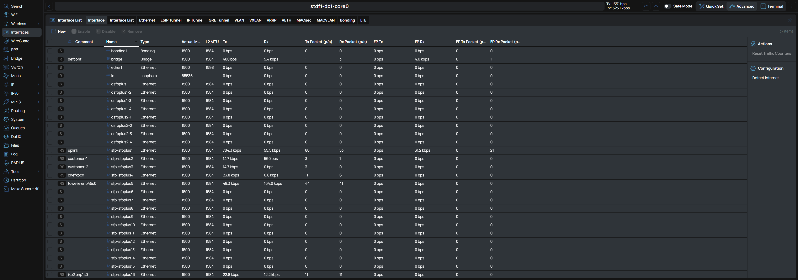

[](https://github.com/tall1on/routeros-darkmode-extension/releases/tag/v7.20.0)


# Mikrotik RouterOS Dark Mode Extension



Chrome extension that applies a dark theme to the MikroTik RouterOS (WebFig) web interface.

## Prerequisites

- Node.js 18+ (LTS recommended)
- npm (bundled with Node.js)

## Installation

```bash
npm install
```

## Available Scripts

- `npm run clean` – Remove build artifacts (`dist/` and `.rollup.cache/`).
- `npm run build` – Produce production bundles for content script, background worker, styles, and copy static assets to `dist/`.
- `npm run watch` – Watch source files and rebuild on change.

All build artifacts are emitted to the `dist/` directory with the following layout:

```
dist/
├── manifest.json
├── content/
│   └── index.js
├── background/
│   └── serviceWorker.js
├── css/
│   └── routeros-dark.css
└── assets/
    └── icons/
        ├── icon16.png
        ├── icon32.png
        ├── icon48.png
        └── icon128.png
```

## Development Notes

- **Icons:** The files in `src/assets/icons/` are text placeholders. Replace them with real PNG assets matching the manifest declarations before shipping to the Chrome Web Store.
- **Styles:** The SCSS entry file (`routeros-dark.scss`) is imported from the content script solely to trigger bundling. Stylesheets are extracted into the `dist/css/` directory by Rollup.
- **Background Worker:** The background service worker is currently a stub ready for future enhancements (e.g., telemetry, synchronized settings).

## License

See [`LICENSE`](LICENSE) for details.
